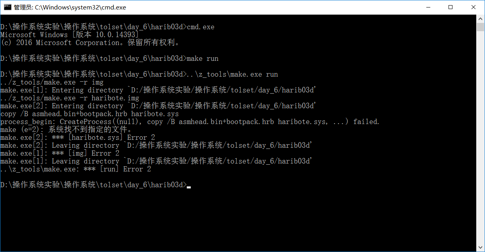
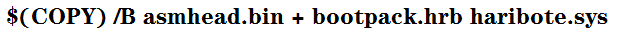

**记录在学习《30天自制操作系统》过程中出现的错误**
==
1.Make过程中无法执行copy指令，系统找不到指定文件
--
   
   
   **原因**：可能是make.exe中无法执行copy指令了（猜测的，因为直接在cmd中是可以运行copy指令的）
   
   **解决方法**：将Makefile文件里的copy指令全部换成用cmd来调用。如下所示：
   ```
   cmd.exe /C copy
   如下图所示：
   ```
   
   
